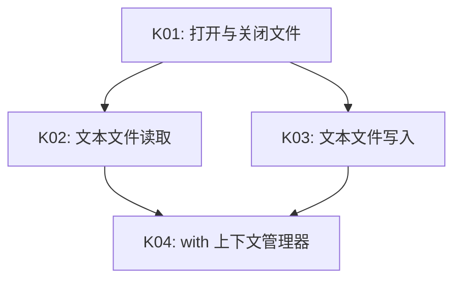

# 知识点地图

<!-- AI-MANAGED:START -->
## 依赖图谱

## 知识点明细

| K编号 | 知识点 | 资料锚点 | 前置依赖 | 核心证据类型 | 状态 | 备注 |
|---|---|---|---|---|---|---|
| K01 | 打开与关闭文件 | S1-01 | 无 | 纠错、说明 | 稳定掌握 |  |
| K02 | 文本文件读取 | S1-01 | K01 | 应用、复述 | 学习中 | 包含 read/readline/readlines 辨析 |
| K03 | 文本文件写入 | S1-01 | K01 | 应用 | 未学 |  |
| K04 | with 上下文管理器 | S1-02 | K02, K03 | 迁移、纠错 | 未学 |  |
<!-- AI-MANAGED:END -->
